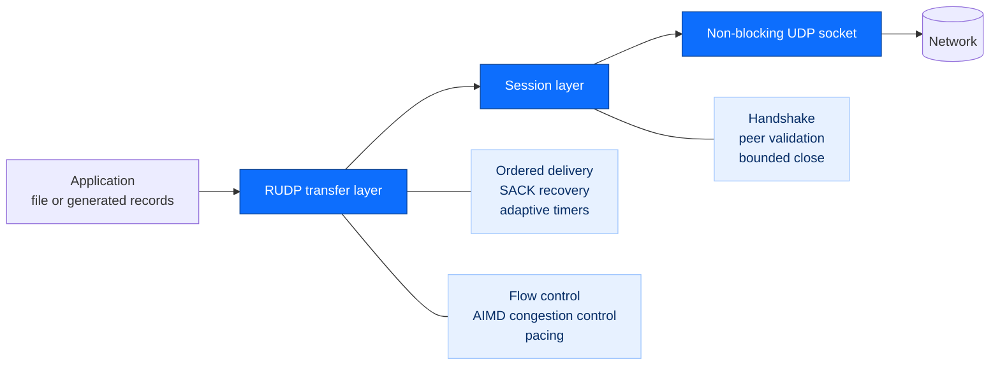
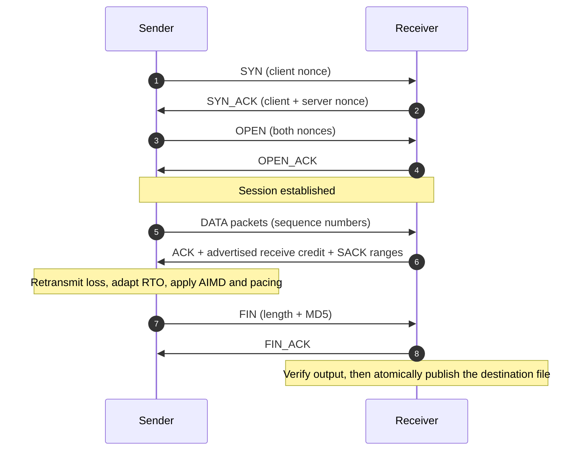
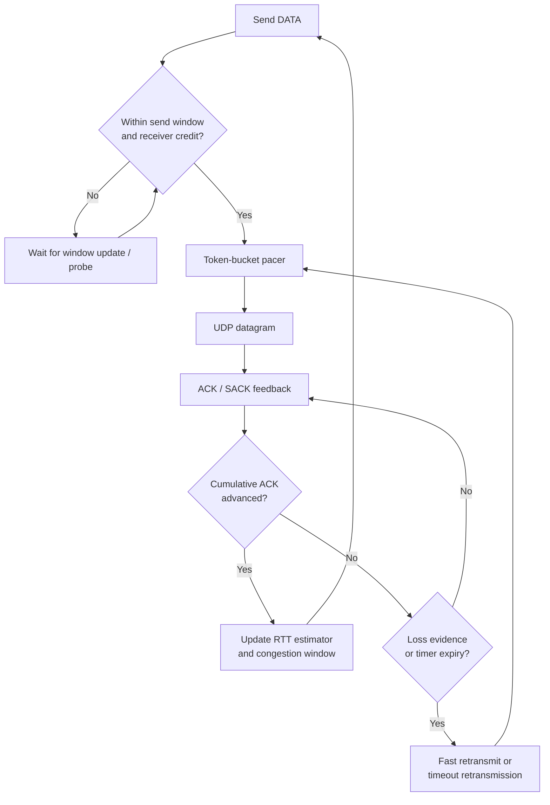
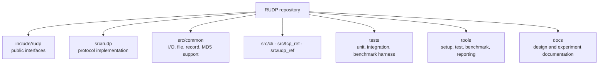

# Reliable Datagram Protocol

[](https://github.com/ibrahimk21/RUDP/actions/workflows/ci.yml)
[](https://en.cppreference.com/w/c/11)
[](docs/environment.md)

> A reliable, connection-oriented transport protocol built over UDP in C11.

RUDP is a systems-programming project that makes the machinery behind reliable
network delivery explicit: session setup, ordered transfer, loss recovery,
flow control, congestion control, pacing, and verified file publication. It
pairs the implementation with deterministic tests and a reproducible Linux
network-emulation harness.

```text
UDP is fast and lightweight—but it does not guarantee delivery, ordering,
congestion behavior, or a safe application-level completion boundary.
RUDP builds those guarantees deliberately, in a compact C codebase.
```

> **Project scope:** designed for controlled Linux environments and learning.
> RUDP is not encrypted or authenticated and is not intended for public-Internet
> deployment.

## At a glance

| | |
| --- | --- |
| **Language** | C11 with strict compiler warnings |
| **Runtime model** | Non-blocking POSIX sockets, `poll`, monotonic timers |
| **Reliability** | Ordered delivery, retransmission, SACK, adaptive RTO |
| **Traffic control** | Receiver flow control, AIMD, token-bucket pacing |
| **File safety** | MD5 verification and atomic no-overwrite commits |
| **Quality bar** | Unit + integration tests, formatting, static analysis, CI |

## The problem it solves

UDP delivers independent datagrams. An application using it must decide what to
do when packets arrive late, arrive twice, arrive out of order, or disappear.
RUDP provides a focused answer to those questions while retaining the visibility
and message-oriented nature of UDP.



## How a transfer works

The sender and receiver first establish a lightweight session. Both sides
validate nonce-bearing control packets, which binds the session to its peer and
makes setup retries safe. Data then moves through bounded send and receive
windows. The receiver reports cumulative progress plus selective acknowledgments
for packets received out of order; the sender uses that feedback to recover loss
without needlessly resending data that already arrived.



### Reliability and control mechanisms



- **Sliding windows:** bound memory usage while allowing multiple packets in flight.
- **Selective acknowledgments (SACK):** identify out-of-order packets that arrived
  so recovery targets only missing data.
- **Adaptive retransmission timer:** derives RTO from measured RTT and uses
  exponential backoff when progress stops.
- **Flow control:** receiver-advertised credit prevents a fast sender from
  overrunning receiver buffering.
- **Congestion control and pacing:** AIMD responds to loss; a shared
  token-bucket pacer smooths original sends and retransmissions.
- **Verified completion:** byte count and MD5 must match before the receiver
  atomically creates the requested output path.

## What this project demonstrates

| Area | Evidence in the codebase |
| --- | --- |
| **Protocol design** | Packet codec, nonce-validated state machine, bounded close semantics |
| **Event-driven systems** | `poll`-driven UDP adapter and injected monotonic clock for deterministic testing |
| **Algorithmic recovery** | Sliding windows, SACK scoreboard, fast retransmit, adaptive RTO, AIMD |
| **Defensive I/O** | Checked file reads/writes, source identity checks, atomic no-replace output commit |
| **Engineering discipline** | Strict warnings, format/lint gates, sanitizers, deterministic unit and live integration tests |
| **Experimental rigor** | Reproducible `ip`/`tc` topology, fault injection, TCP and raw-UDP reference programs |

## Quick start

The supported environment is Ubuntu 24.04, including Ubuntu under WSL2. You
need a C11 compiler, Make, Python 3, and POSIX sockets.

```sh
git clone https://github.com/ibrahimk21/RUDP.git
cd RUDP
./tools/bootstrap_ubuntu.sh
make configure
make test
make integration
```

## Try a file transfer

Build the programs, then start the receiver before the sender. The output path
must not already exist.

```sh
make build

# Terminal 1 — receiver
./build/rudp receive 9000 received.bin

# Terminal 2 — sender
./build/rudp send 127.0.0.1 9000 source.bin
```

Each process emits one JSON status record on exit. A successful transfer proves
that the destination length and MD5 digest match the sender’s snapshot before
the output becomes visible.

## Repository map



## Development commands

```sh
make build         # library and command-line programs
make test          # deterministic unit tests
make integration   # live loopback tests
make bench-test    # benchmark-harness tests
make format-check  # verify C formatting
make lint          # run cppcheck
make sanitize      # run unit tests with ASan and UBSan
```

## Further reading

- [Protocol design notes](docs/design.md)
- [Benchmark harness](docs/benchmark-harness.md)
- [Benchmark preflight and safety checks](docs/benchmark-preflight.md)
- [Development environment](docs/environment.md)
